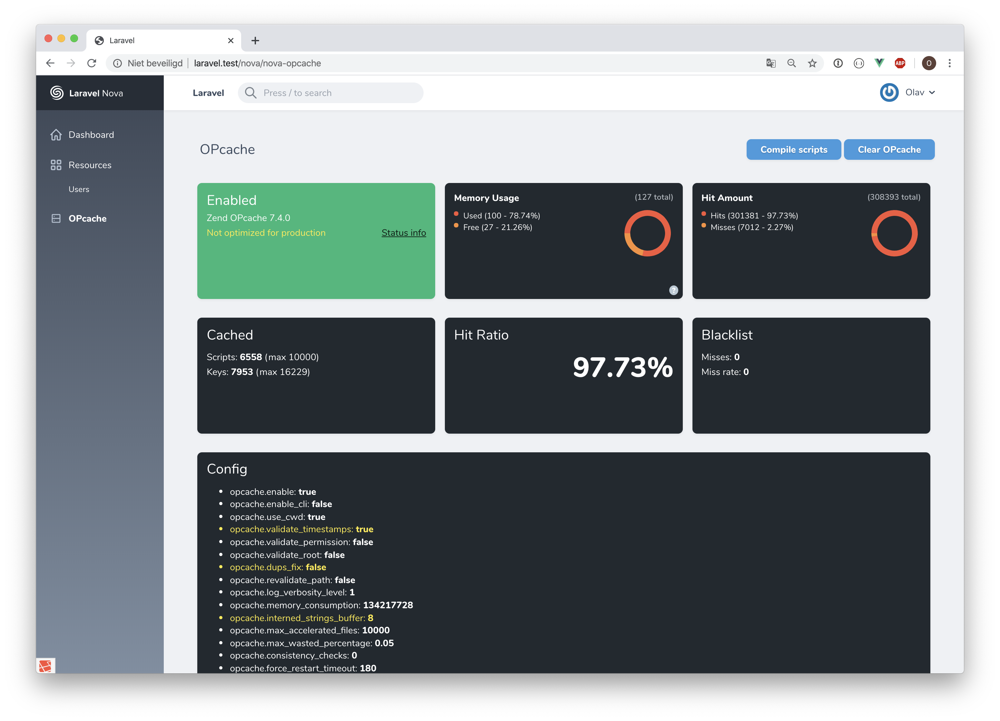

# Laravel Nova OPcache

[](https://packagist.org/packages/appstract/nova-opcache)
[](LICENSE.md)
[](https://packagist.org/packages/appstract/nova-opcache)

OPcache tool for Laravel Nova.



## Installation

You can install the package via Composer:

``` bash
composer require appstract/nova-opcache
```

Next require the tool in the Nova service provider:

```` php
    public function tools()
    {
        return [
            ...
            new \Appstract\NovaOpcache\NovaOpcache(),
            ...
        ];
    }
````

This package uses [the OPcache package for Laravel](https://github.com/appstract/laravel-opcache), head to that repository for OPcache configuration.

## Contributing

Contributions are welcome, [thanks to y'all](https://github.com/appstract/nova-opcache/graphs/contributors) :)

## About Appstract

Appstract is a small team from The Netherlands. We create (open source) tools for webdevelopment.

## License

The MIT License (MIT). Please see [License File](LICENSE.md) for more information.
